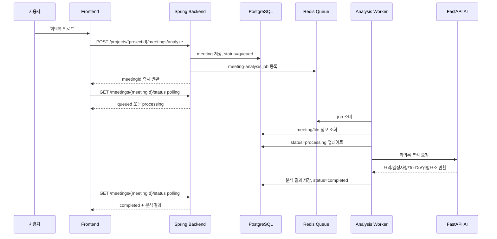

# WorkFlow AI 회의록 Redis Queue 구조

## 문서 목적

이 문서는 WorkFlow AI의 **회의록 AI 분석 기능**에서 Redis Queue가 어떤 역할을 하는지 설명하기 위한 구조 문서이다.

팀장 개발 중인 챗봇 또는 프로젝트 기술 문서에 반영할 수 있도록, 회의록 기능 기준으로 필요한 Redis Queue 구조만 정리한다.

현재 회의록 AI 분석은 Spring 내부 비동기 처리와 DB 상태 저장 방식으로 동작한다. Redis Queue는 향후 분석 작업을 더 안정적으로 처리하기 위한 고도화 구조이다.

## 적용 대상

Redis Queue 적용 대상은 회의록 기능 중 다음 작업이다.

- 회의록 업로드 후 AI 분석 작업
- PDF/DOCX 텍스트 추출 후 분석 요청
- HuggingFace/Ollama/FastAPI 분석 호출
- 회의 요약 생성
- 결정사항 추출
- To-Do 후보 생성
- 담당자 후보 검증
- 중요도 산정
- 근거 문장 저장
- 분석 실패 시 재시도
- 분석 완료/실패 상태 저장

## 현재 구조

현재 구조는 Redis Queue 없이 Spring 내부 비동기 실행으로 처리된다.

```text
회의록 업로드
→ Spring Backend가 회의록 DB 저장
→ analysis_status = processing
→ Spring 내부 비동기 Runner 실행
→ FastAPI 회의록 분석 호출
→ 분석 결과 DB 저장
→ analysis_status = completed 또는 failed
→ Frontend가 status polling으로 결과 확인
```

현재 구조는 초기 개발과 시연에는 충분하지만, 다음 한계가 있다.

- 서버 재시작 시 진행 중인 분석 작업이 유실될 수 있다.
- 여러 사용자가 동시에 회의록을 업로드하면 서버 내부 스레드에 부담이 생긴다.
- 작업 대기열을 명확히 관리하기 어렵다.
- 실패한 작업의 재시도 횟수와 지연 재시도를 관리하기 어렵다.
- 분석 작업이 몇 개 대기 중인지 모니터링하기 어렵다.
- 서버 인스턴스가 늘어날 경우 중복 실행 방지가 어려워진다.

## Redis Queue 도입 후 목표 구조

Redis Queue를 도입하면 회의록 분석 요청을 즉시 처리하지 않고, Queue에 작업으로 등록한 뒤 Worker가 순차적으로 처리한다.

```text
회의록 업로드
→ Spring Backend가 회의록 DB 저장
→ analysis_status = queued 또는 processing
→ Redis Queue에 meeting-analysis job 등록
→ Worker가 Queue에서 job 소비
→ FastAPI 회의록 분석 호출
→ 분석 결과 DB 저장
→ analysis_status = completed 또는 failed
→ Frontend가 기존처럼 status polling으로 결과 확인
```

핵심은 **Frontend 흐름은 유지하고, Backend 내부 분석 실행 구조만 Queue 기반으로 바꾸는 것**이다.

## 전체 처리 흐름



## Redis Queue 역할

Redis Queue는 회의록 분석 작업을 임시로 보관하고 처리 순서를 관리한다.

주요 역할:

- 오래 걸리는 AI 분석 작업을 API 응답 흐름에서 분리
- 동시에 들어온 회의록 분석 요청을 순서대로 처리
- Worker 처리량에 맞춰 분석 요청을 조절
- 실패한 작업 재시도 관리
- 대기 중, 처리 중, 실패한 작업 상태 추적
- 서버 부하 완화
- 향후 Worker 수평 확장 기반 제공

## Queue 이름 제안

```text
meeting-analysis
```

확장 시 다음 Queue를 추가할 수 있다.

```text
meeting-analysis:retry
meeting-analysis:dead-letter
meeting-analysis:priority
```

각 Queue 의미:

| Queue | 역할 |
| --- | --- |
| meeting-analysis | 일반 회의록 분석 작업 |
| meeting-analysis:retry | 실패 후 재시도 대기 작업 |
| meeting-analysis:dead-letter | 재시도 횟수 초과로 최종 실패한 작업 |
| meeting-analysis:priority | 긴급/우선 분석 작업 |

초기 구현에서는 `meeting-analysis` 하나만 사용해도 충분하다.

## Job Payload 구조

Redis Queue에 넣는 job에는 회의록 전체 원문을 직접 넣지 않는 것이 좋다.

회의록 원문은 길고 민감한 정보가 포함될 수 있으므로, Queue에는 DB/File reference만 저장한다.

예시:

```json
{
  "jobId": "meeting-analysis-123",
  "meetingId": 123,
  "projectId": 1,
  "uploadedBy": 5,
  "sourceType": "document",
  "filePath": "/uploads/meeting-123.pdf",
  "retryCount": 0,
  "requestedAt": "2026-07-21T10:30:00"
}
```

필드 설명:

| 필드 | 설명 |
| --- | --- |
| jobId | Redis Queue 작업 식별자 |
| meetingId | DB meetings 테이블의 회의록 ID |
| projectId | 프로젝트 ID |
| uploadedBy | 업로드한 사용자 ID |
| sourceType | document, audio 등 회의록 입력 유형 |
| filePath | 저장된 파일 경로 |
| retryCount | 현재 재시도 횟수 |
| requestedAt | 작업 등록 시각 |

## 회의록 분석 상태값

회의록 분석 상태는 DB에 저장한다.

권장 상태값:

```text
uploaded
queued
processing
completed
failed
```

상태 설명:

| 상태 | 의미 |
| --- | --- |
| uploaded | 회의록 파일 업로드 완료 |
| queued | Redis Queue에 분석 작업 등록 완료 |
| processing | Worker가 분석 작업 처리 중 |
| completed | 분석 성공 및 결과 저장 완료 |
| failed | 분석 실패 |

현재 Frontend가 `processing / completed / failed` 중심으로 polling하고 있다면, 초기에는 `queued`를 화면에서 `processing`처럼 보여줘도 된다.

## Spring Backend 역할

Spring Backend는 회의록 분석 요청을 직접 오래 처리하지 않고, 분석 작업을 Queue에 등록하는 역할을 맡는다.

주요 역할:

- 회의록 업로드 API 제공
- 프로젝트 권한 검증
- 참석자 정보 저장
- meeting row 생성
- analysis_status 저장
- Redis Queue에 job 등록
- 상태 조회 API 제공
- 재시도 API 제공
- 분석 결과 조회 API 제공

Spring 처리 흐름:

```text
1. 요청 사용자 권한 확인
2. 회의록 파일 저장
3. meetings row 저장
4. meeting_attendees 저장
5. analysis_status = queued 저장
6. Redis Queue에 meeting-analysis job 등록
7. meetingId 반환
```

## Worker 역할

Worker는 Redis Queue에서 회의록 분석 job을 꺼내 실제 분석 처리를 수행한다.

주요 역할:

- Queue에서 job 소비
- meetingId 기준으로 DB 조회
- 회의록 파일 또는 텍스트 로딩
- PDF/DOCX 텍스트 추출
- FastAPI 분석 호출
- 결과 검증
- To-Do 후보 저장
- 담당자 후보 검증
- 중요도 산정 결과 저장
- 성공/실패 상태 DB 반영

Worker 처리 흐름:

```text
1. Redis Queue에서 job 가져오기
2. meetingId로 회의록 조회
3. status = processing 변경
4. 파일/본문 추출
5. FastAPI 분석 호출
6. 분석 결과 후처리
7. DB에 analysis/todos/risks/keywords 저장
8. status = completed 변경
9. 실패 시 retry 또는 failed 처리
```

## FastAPI 역할

FastAPI는 실제 AI 분석을 수행한다.

주요 역할:

- 회의록 텍스트 분석
- 회의 요약 생성
- 결정사항 추출
- To-Do 후보 생성
- 담당자 후보 추론
- 중요도 판단
- 위험요소 추출
- 키워드 추출
- 근거 문장 반환

FastAPI는 Queue를 직접 몰라도 된다. Worker가 FastAPI를 호출하는 방식으로 분리하면 된다.

## Frontend 영향

Frontend는 큰 변경 없이 기존 polling 구조를 유지할 수 있다.

유지되는 흐름:

```text
회의록 업로드
→ meetingId 즉시 수신
→ 분석 중 화면 표시
→ status polling
→ completed 시 결과 표시
→ failed 시 재시도 버튼 표시
```

추가로 표시할 수 있는 상태:

| 상태 | 화면 문구 예시 |
| --- | --- |
| queued | 분석 대기 중입니다. |
| processing | 회의록을 분석 중입니다. |
| completed | 분석이 완료되었습니다. |
| failed | 분석에 실패했습니다. 다시 시도해주세요. |

## 재시도 정책

회의록 분석은 외부 AI 모델 호출, 문서 파싱, 네트워크 문제로 실패할 수 있다.

권장 재시도 정책:

- 최대 재시도 횟수: 3회
- 재시도 간격: 30초 → 1분 → 3분
- 재시도 횟수 초과 시 `failed`
- 사용자에게는 안전한 메시지만 표시
- 원본 오류는 서버 로그에 저장

사용자 메시지 예:

```text
회의록 분석 중 오류가 발생했습니다. 잠시 후 다시 시도해주세요.
```

서버 로그 예:

```text
HuggingFace timeout
FastAPI connection refused
PDF text extraction failed
```

## 타임아웃 정책

AI 분석은 오래 걸릴 수 있으므로 작업 단위 타임아웃이 필요하다.

권장 기준:

| 작업 | 권장 타임아웃 |
| --- | --- |
| PDF/DOCX 텍스트 추출 | 30초 |
| FastAPI 분석 호출 | 60초 |
| 전체 job 처리 | 2~3분 |

타임아웃 시:

```text
status = failed
errorMessage = "분석 시간이 초과되었습니다. 잠시 후 다시 시도해주세요."
```

## 중복 실행 방지

같은 회의록에 대해 분석 job이 여러 번 등록되면 안 된다.

권장 방식:

- meetingId 기준으로 status가 `queued` 또는 `processing`이면 새 job 등록 금지
- retry 요청 시 기존 상태 확인
- 필요하면 Redis lock 또는 DB row lock 사용

예:

```text
meetingId=123이 processing 상태이면 새 분석 요청을 만들지 않고 현재 상태만 반환
```

## DB 저장 항목

Redis Queue 구조에서도 최종 상태와 결과의 기준은 DB이다.

회의록 테이블 또는 관련 테이블에 필요한 정보:

```text
analysis_status
analysis_error_message
analysis_started_at
analysis_completed_at
analysis_retry_count
analysis_job_id
```

분석 결과 저장 대상:

- 회의 요약
- 결정사항
- To-Do 후보
- 담당자 후보
- 중요도
- 근거 문장
- 위험요소
- 키워드

## Worker 구현 방식 선택지

### 1. Spring 내부 Worker

Spring이 Redis Queue를 소비한다.

장점:

- 현재 구조와 가장 비슷하다.
- DB 저장 로직을 재사용하기 쉽다.
- 초기 구현 비용이 낮다.

단점:

- Spring 서버에 분석 작업 책임이 남는다.
- 트래픽이 커지면 API 서버와 Worker 부하가 섞인다.

초기 추천 방식이다.

### 2. FastAPI Worker

FastAPI가 Redis Queue를 소비한다.

장점:

- AI 분석 책임이 Python/FastAPI 쪽에 모인다.
- AI/ML 작업과 구조적으로 잘 맞는다.

단점:

- DB 상태 저장과 권한 검증을 위해 Spring과 다시 연동해야 한다.
- 프로젝트 권한/사용자 검증 경계가 복잡해진다.

### 3. 별도 Worker 서비스

Spring/FastAPI와 분리된 별도 Worker 컨테이너를 둔다.

장점:

- 확장성이 좋다.
- Worker 수를 독립적으로 늘릴 수 있다.
- 운영 안정성이 높다.

단점:

- 배포 구성이 복잡해진다.
- 초기 구현 범위가 커진다.

장기적으로 추천되는 방식이다.

## 추천 도입 순서

### 1단계: 설계 확정

- Queue 이름 확정
- Job payload 확정
- 상태값 확정
- retry/timeout 정책 확정

### 2단계: Queue 등록 추가

- 회의록 업로드 시 Redis Queue에 job 등록
- DB 상태를 `queued`로 저장
- 기존 내부 비동기 Runner는 fallback으로 유지 가능

### 3단계: Worker 처리 전환

- Worker가 Redis Queue에서 job 소비
- FastAPI 분석 호출
- DB 결과 저장
- 기존 내부 Executor 의존도 축소

### 4단계: 운영 안정화

- retry 적용
- timeout 적용
- dead-letter queue 적용
- 분석 작업 모니터링 추가

## 챗봇 반영용 요약

챗봇이 회의록 Redis Queue 구조를 설명할 때 사용할 수 있는 요약:

```text
WorkFlow AI의 회의록 AI 분석은 시간이 오래 걸리는 작업이므로 Redis Queue를 통해 백그라운드 작업으로 분리할 수 있다.
회의록 업로드 시 Spring Backend는 회의록을 DB에 저장하고 meeting-analysis job을 Redis Queue에 등록한다.
Worker는 Queue에서 job을 꺼내 FastAPI AI 분석을 호출하고, 분석 결과와 상태를 DB에 저장한다.
Frontend는 기존처럼 meetingId 기준으로 분석 상태를 polling하여 queued, processing, completed, failed 상태를 표시한다.
이 구조를 사용하면 동시 업로드, 분석 지연, 실패 재시도, 서버 부하 문제를 더 안정적으로 관리할 수 있다.
```

## 팀장 확인 필요 사항

- Redis Queue 도입 범위를 회의록 AI 분석으로 한정할지
- 초기 Worker를 Spring 내부로 둘지, 별도 Worker 서비스로 둘지
- retry 횟수와 timeout 기준
- `queued` 상태를 프론트에 별도로 표시할지
- 운영 Redis 인스턴스 구성 방식
- 회의록 원문을 Redis에 넣지 않고 DB/file reference만 넣는 방향에 동의하는지

## 결론

회의록 AI 분석은 문서 파싱, LLM 호출, To-Do 생성, 담당자 검증, 중요도 산정까지 포함하는 무거운 작업이다.

따라서 장기적으로는 Redis Queue를 사용해 분석 작업을 API 응답 흐름에서 분리하는 것이 적절하다.

추천 구조:

```text
Spring Backend = 요청 접수, 권한 검증, DB 상태 관리, Queue 등록
Redis Queue = 회의록 분석 작업 대기열
Worker = Queue 소비, FastAPI 호출, 결과 저장
FastAPI = 실제 AI 분석
Frontend = 상태 polling 및 결과 표시
```

이 구조는 현재 회의록 기능의 프론트 흐름을 크게 바꾸지 않으면서, 분석 안정성, 재시도 관리, 확장성을 높일 수 있다.
